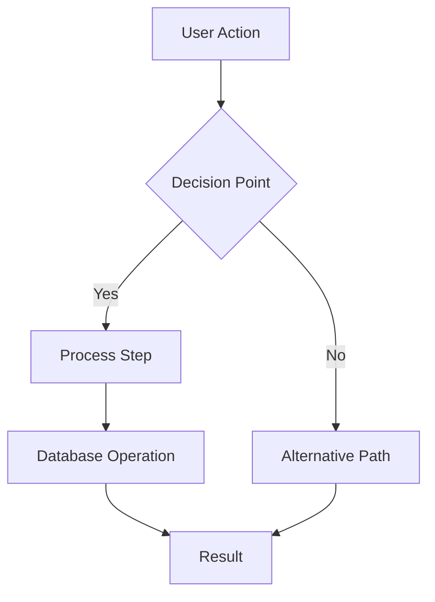
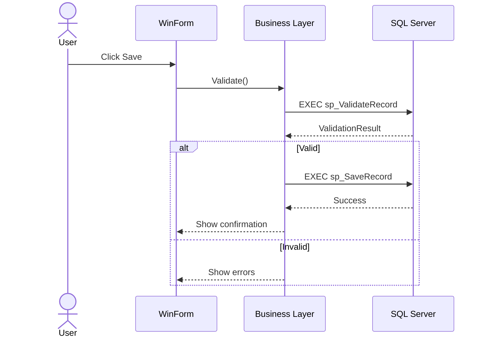
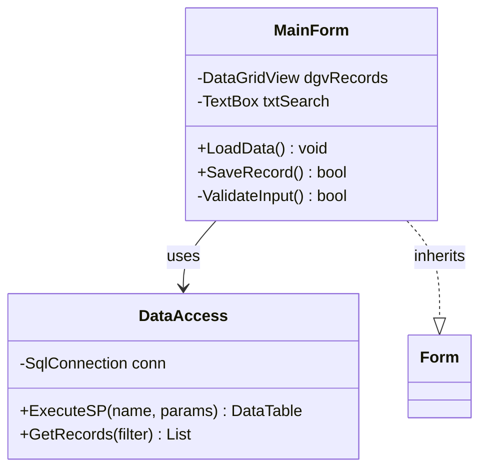
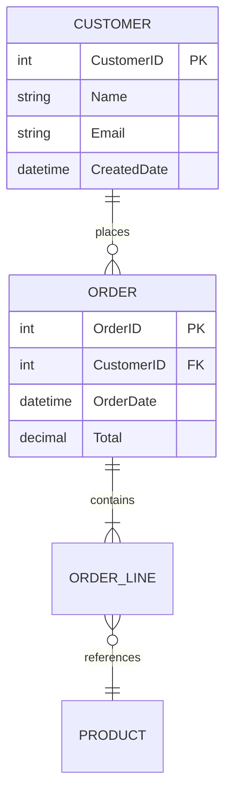
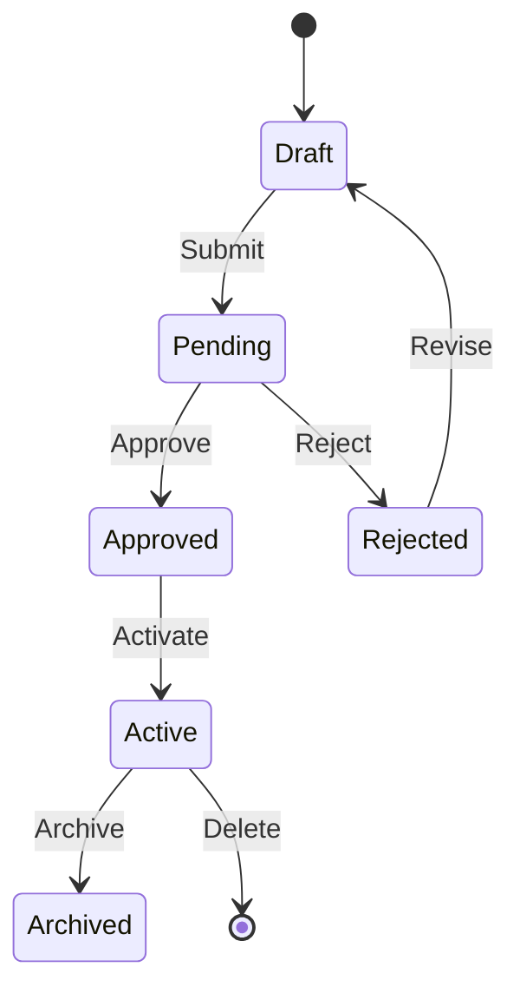
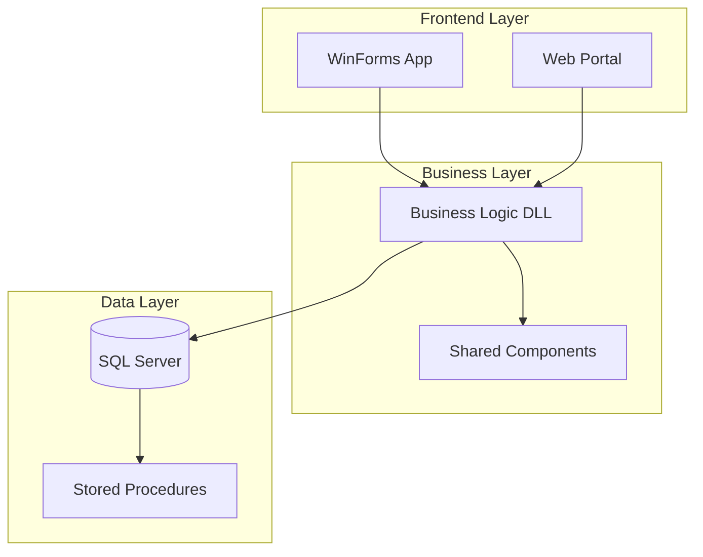

## Purpose

Generate professional, readable Mermaid diagrams in markdown reports. All process maps, architecture diagrams, data flows, and relationship visualizations MUST use Mermaid syntax — never ASCII art, box-drawing characters, or plain text diagrams.

## Diagram Types and When to Use Them

### Flowchart — Business Process Flows
Use for: UI workflows, decision trees, business logic paths, stored procedure logic



**Rules:**
- Use `TD` (top-down) for business processes
- Use `LR` (left-right) for data pipelines
- Decision nodes use `{curly braces}`
- Process nodes use `[square brackets]`
- Database/storage nodes use `[(cylinder)]` or `[(Database)]`
- Group related steps with `subgraph`

### Sequence Diagram — Component Interactions
Use for: API calls, form submissions, stored procedure call chains, service interactions



**Rules:**
- Always include `actor User` for user-initiated flows
- Use `participant X as Display Name` for readable labels
- Use `->>` for sync calls, `-->>` for responses
- Use `alt/else/end` for conditional branches
- Use `loop` for repeated operations
- Use `Note over X,Y: text` for annotations

### Class Diagram — Code Architecture
Use for: Class hierarchies, inheritance, form structures, component relationships



**Rules:**
- Show key fields and methods (not every one)
- Use `-->` for composition/dependency
- Use `..|>` for inheritance
- Use `--o` for aggregation
- Mark visibility: `+` public, `-` private, `#` protected

### ER Diagram — Data Models
Use for: Database schemas, table relationships, stored procedure I/O



**Rules:**
- Always mark PK and FK
- Show data types
- Use correct cardinality notation
- Group related tables visually

### State Diagram — Phase/Status Flows
Use for: Record lifecycle, approval workflows, migration phase progression



### Architecture / Deployment Diagram (Flowchart with subgraphs)
Use for: System architecture, deployment topology, integration maps



## Formatting Standards

1. **Every process map MUST have at least one Mermaid diagram** — preferably a flowchart for the overall flow and sequence diagrams for detailed interactions
2. **Label all nodes clearly** — use business-friendly names, not code identifiers
3. **Add subgraphs** to group related components (UI layer, business layer, data layer)
4. **Use consistent styling:**
   - Colors via `style` or `classDef` for status: green=success, red=error, blue=active, gray=inactive
   - Keep diagrams under 20 nodes for readability — split larger flows into sub-diagrams
5. **Include a legend** if using color coding
6. **Wrap diagram in markdown fenced code block**: ` ```mermaid ... ``` `
7. **Pair each diagram with a brief text description** explaining the flow in 2-3 sentences

## Anti-Patterns (Never Do These)

- ❌ ASCII art boxes: `+--------+`
- ❌ Arrow text: `Form --> BL --> DB`
- ❌ Plain text flowcharts: `Step 1 -> Step 2 -> Step 3`
- ❌ Tables pretending to be flowcharts
- ❌ Diagrams with 30+ nodes (split them)
- ❌ Unlabeled arrows or generic node names like "Process" or "Step"
