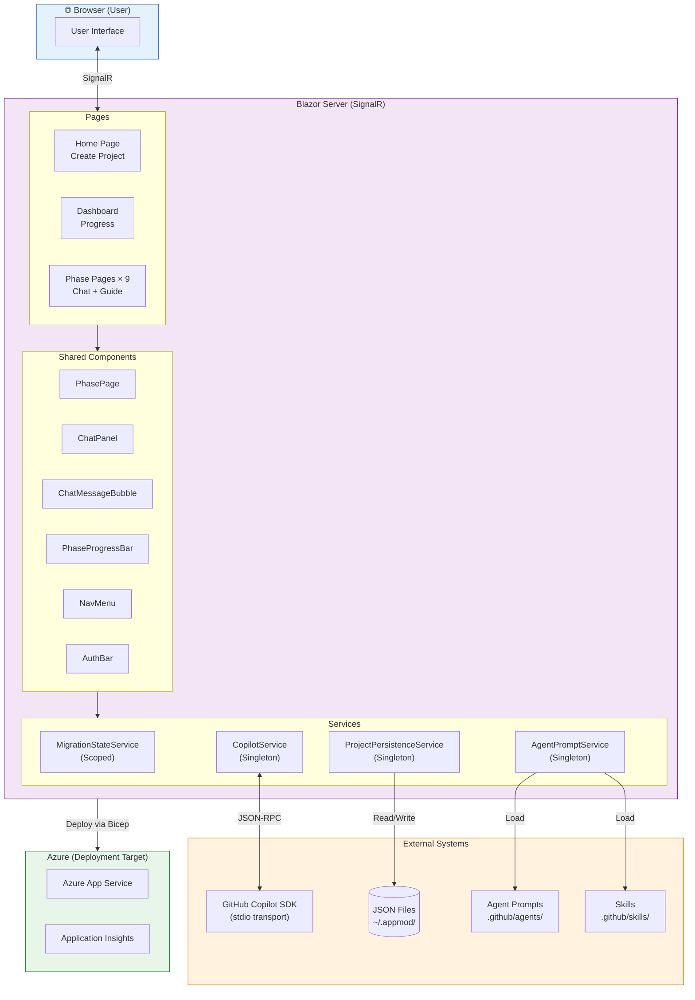
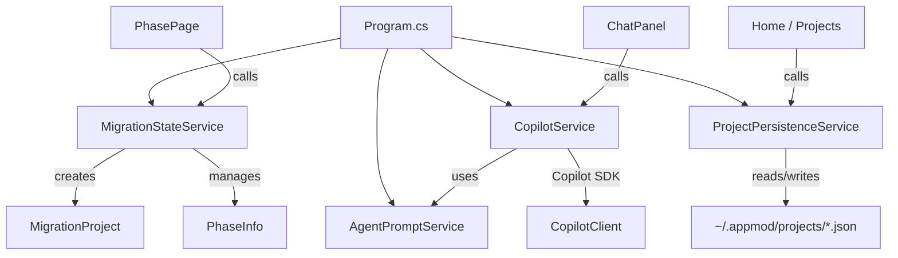
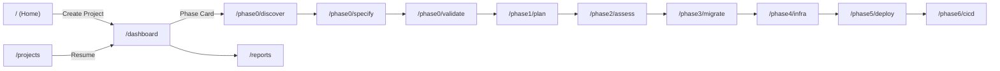

# Legacy Discovery Report — AppModernization.Web

> **Generated**: 2026-03-30  
> **Phase**: 0 — Discovery  
> **Application**: GitHub Copilot Agents for Code Migration & Modernization  

---

## Executive Summary

**AppModernization.Web** is a **Blazor Server** web application built on **.NET 10** that provides an AI-assisted, multi-phase workflow for migrating legacy .NET and Java applications to modern Azure-hosted platforms. It integrates the **GitHub Copilot SDK** for conversational AI guidance through each migration phase, and persists project state as JSON files on disk.

The application is **not itself a legacy system** — it is a modern migration tool. This discovery report documents its architecture, components, and behavior as a foundation for future evolution or extension.

---

## Application Inventory

| Category | Count | Details |
|----------|-------|---------|
| Solution Projects | 2 | Web app + xUnit test project |
| Razor Components (Pages) | 14 | Home, Dashboard, 9 phase pages, Projects, Reports, NotFound |
| Razor Components (Shared) | 12 | Layout, Nav, Auth, Chat, Progress, Report viewers |
| Services | 4 | AgentPrompt, Copilot, MigrationState, ProjectPersistence |
| Models | 3 | MigrationProject, PhaseInfo, ChatMessage |
| Agent Definitions | 12 | `.github/agents/*.agent.md` |
| Skills | 5 | `.github/skills/` (dotnet-legacy, dotnet-migration, sql-sp, java-legacy, azure-hosting) |
| Bicep IaC Modules | 3 | main.bicep, appService.bicep, monitoring.bicep |
| Test Cases | 8 | Integration tests via WebApplicationFactory |
| Static Assets | ~60 | Bootstrap 5, custom CSS, favicon |

---

## Technology Stack

| Layer | Technology | Version |
|-------|-----------|---------|
| **Runtime** | .NET | 10.0 |
| **UI Framework** | Blazor Server (Interactive Server) | — |
| **CSS Framework** | Bootstrap | 5.x |
| **AI Integration** | GitHub Copilot SDK | 0.2.0 |
| **Authentication** | ASP.NET Core Auth (Cookie + GitHub OAuth + PAT) | — |
| **Markdown Rendering** | Markdig | 1.1.2 |
| **OAuth Provider** | AspNet.Security.OAuth.GitHub | 10.0.0 |
| **Testing** | xUnit | 2.9.3 |
| **IaC** | Azure Bicep | — |
| **Hosting Target** | Azure App Service | — |
| **Deployment CLI** | Azure Developer CLI (`azd`) | — |

---

## Architecture Overview

---

## Component Dependency Map

### Service Dependencies

### Page Navigation Flow

---

## Key Findings

### Strengths
1. **Modern stack** — .NET 10, Blazor Server, Bootstrap 5, GitHub Copilot SDK
2. **Clean separation of concerns** — Models, Services, Components well-organized
3. **Event-driven streaming** — CopilotService uses events for real-time message delivery
4. **Multi-auth support** — OAuth, PAT, and cookie-based fallback
5. **IaC-ready** — Bicep templates for Azure App Service + Application Insights
6. **Integration tests** — Good baseline coverage of startup, routing, and auth

### Observations
1. **File-based persistence** — Projects stored as JSON files in `~/.appmod/projects/`, not a database. Suitable for single-user/dev scenarios but not for multi-user production.
2. **No database** — No SQL, Entity Framework, or other structured data store. All state is in-memory (scoped per circuit) + JSON files.
3. **Copilot SDK v0.2.0** — Early-stage SDK; stdio transport suggests local CLI integration model.
4. **Agent prompts loaded from disk** — `.github/agents/` directory must be present; no fallback if missing.
5. **Scoped state service** — `MigrationStateService` is per-circuit; state is lost if the browser reconnects to a new circuit (Blazor limitation).

### Risk Areas
1. **Circuit reconnection** — If a Blazor circuit drops, in-memory `MigrationStateService` state is lost. The `ReconnectModal` component handles UX, but state recovery depends on `ProjectPersistenceService`.
2. **Concurrent access** — `CopilotService` uses `ConcurrentDictionary` but `ProjectPersistenceService` does not protect against concurrent file writes.
3. **No error persistence** — Chat errors and streaming failures are handled in-memory with retry, but not logged or persisted.
4. **OAuth secret management** — Secrets must be configured via `dotnet user-secrets` locally or Key Vault in Azure; misconfiguration silently degrades to PAT-only auth.

### Unknowns
- How the GitHub Copilot SDK handles long-running sessions and token expiration
- Whether the stdio transport model works in Azure App Service (may need HTTP transport)
- Scaling characteristics under concurrent user load (Blazor Server + SignalR)

---

## Recommendations

Since this application is already a **modern .NET 10 Blazor Server app**, no migration is needed. Potential improvements include:

| Area | Recommendation | Priority |
|------|---------------|----------|
| **Persistence** | Replace JSON file storage with Azure SQL or Cosmos DB for multi-user support | Medium |
| **State Management** | Add circuit-recovery logic to restore `MigrationStateService` from persistence | High |
| **Copilot Transport** | Evaluate HTTP transport for Azure deployment (stdio may not work in App Service) | High |
| **Observability** | Add structured logging (Serilog) and telemetry events for phase transitions | Medium |
| **Testing** | Add unit tests for services (currently only integration tests) | Medium |
| **Concurrent Safety** | Add file locking or switch to database for `ProjectPersistenceService` | Low |
