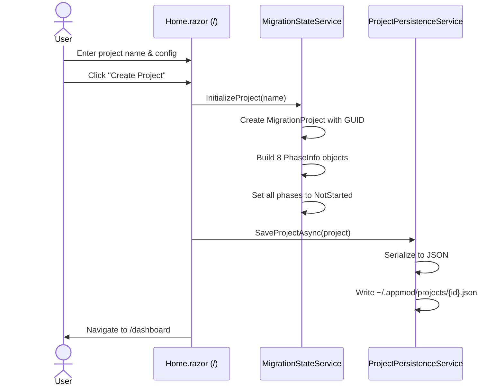
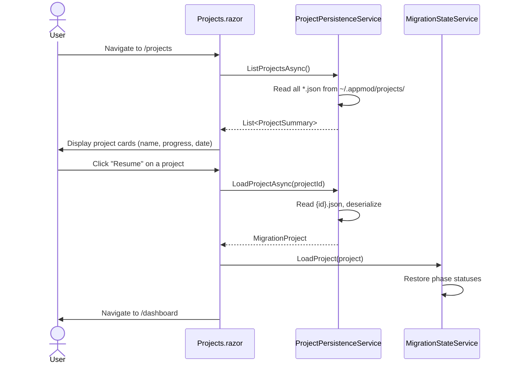
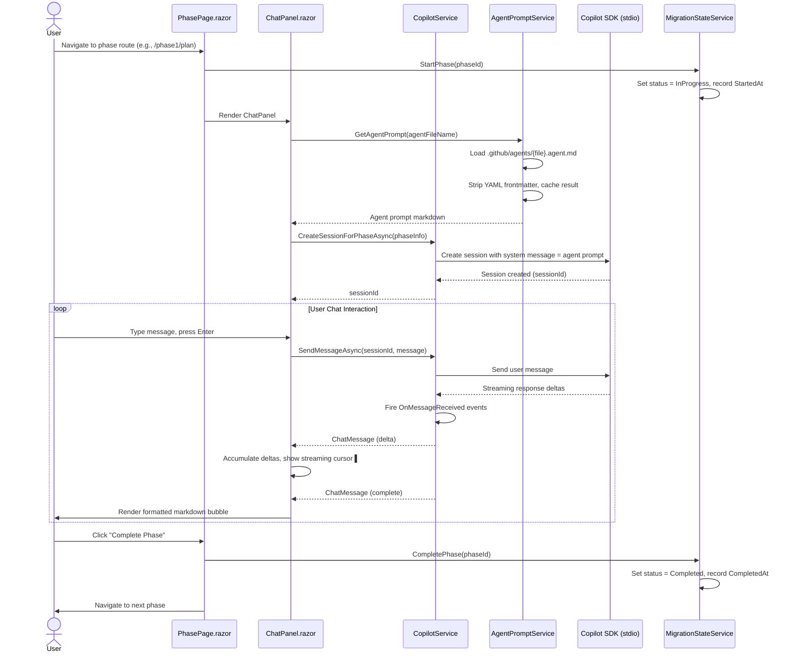
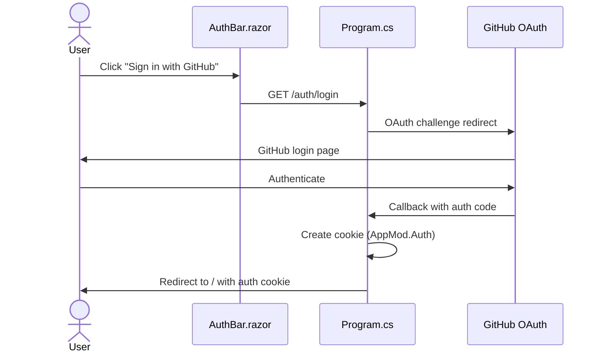
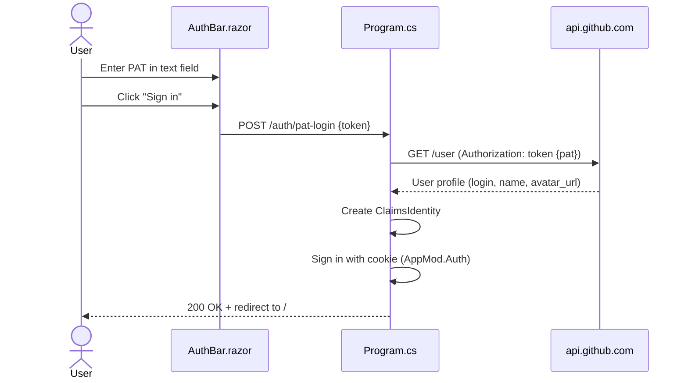
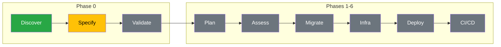
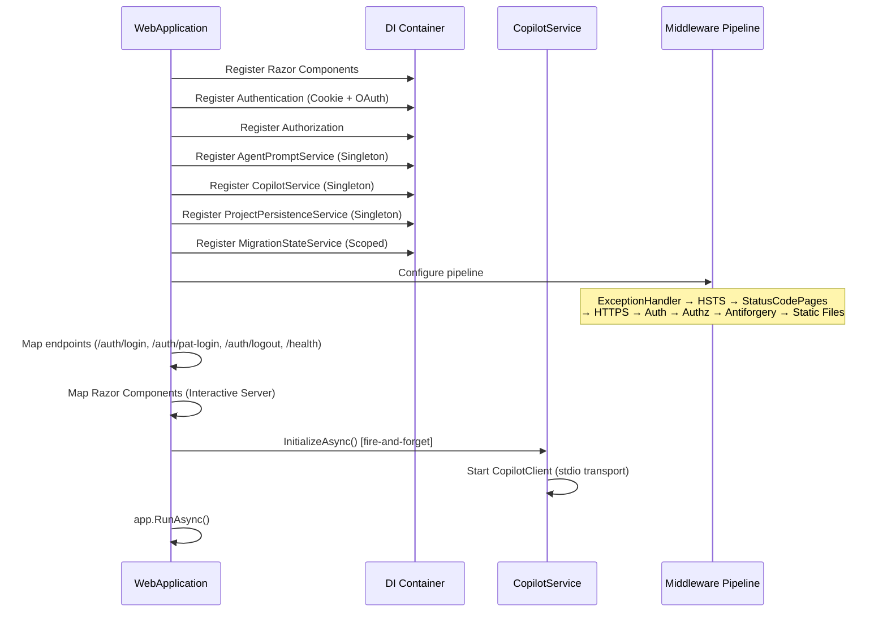

# Process Maps — AppModernization.Web

> **Generated**: 2026-03-30  
> **Phase**: 0 — Discovery  

---

## Process 1: Create New Migration Project

**Trigger**: User visits Home page and fills out the project creation form.



**Decision Points**:
- `UsePhase0`: If true (default), Phase 0 sub-phases are available. If false, they can be skipped.
- `ApplicationType`: Determines which agent prompts are most relevant.

---

## Process 2: Resume Saved Project

**Trigger**: User visits Projects page and selects a saved project.



---

## Process 3: Execute a Migration Phase (Chat Workflow)

**Trigger**: User navigates to a phase page from Dashboard or NavMenu.



**Error Handling**:
- If `CreateSessionForPhaseAsync` fails → error message in chat panel with retry button
- If `SendMessageAsync` fails → error displayed, retry available
- If SignalR circuit drops → `ReconnectModal` shown, state may be lost

---

## Process 4: Authentication Flow (GitHub OAuth)

**Trigger**: User clicks "Sign in with GitHub" button.



---

## Process 5: Authentication Flow (PAT)

**Trigger**: User enters a Personal Access Token in the auth bar.



**Error Handling**:
- Invalid PAT → GitHub API returns 401 → Server returns error response
- Network failure → Exception caught, error returned to client

---

## Process 6: Phase Progress Visualization

**Trigger**: Dashboard or PhaseProgressBar renders.



**Legend**: 🟢 Completed | 🟡 In Progress | ⚫ Not Started | ➖ Skipped

**Visual Indicators** (`PhaseProgressBar.razor`):
- ✓ checkmark for Completed
- Pulsing circle for InProgress
- — dash for Skipped
- Empty circle for NotStarted
- Connecting lines between phase circles

---

## Process 7: Application Startup

**Trigger**: `dotnet run` or Azure App Service starts the process.



---

## End-to-End Data Flow

```
┌──────────┐     ┌──────────┐     ┌──────────────────┐     ┌──────────────┐
│  Browser  │────▶│  Blazor   │────▶│    Services       │────▶│  Persistence │
│  (User)   │◀────│  Server   │◀────│                  │◀────│              │
└──────────┘     │ (SignalR) │     │ MigrationState   │     │ JSON Files   │
                 └──────────┘     │ CopilotService   │     │ ~/.appmod/   │
                                  │ AgentPromptService│     └──────────────┘
                                  │ ProjectPersistence│
                                  └────────┬─────────┘
                                           │
                                  ┌────────┴─────────┐
                                  │  GitHub Copilot   │
                                  │  SDK (stdio)      │
                                  │                   │
                                  │  Agent Prompts    │
                                  │  .github/agents/  │
                                  └───────────────────┘
```
